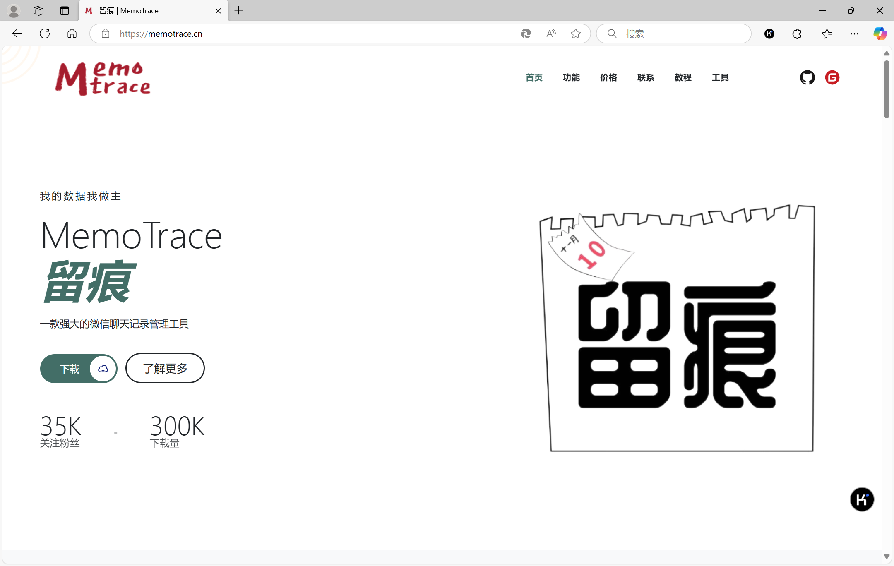
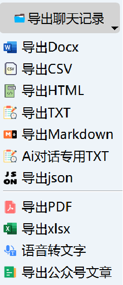
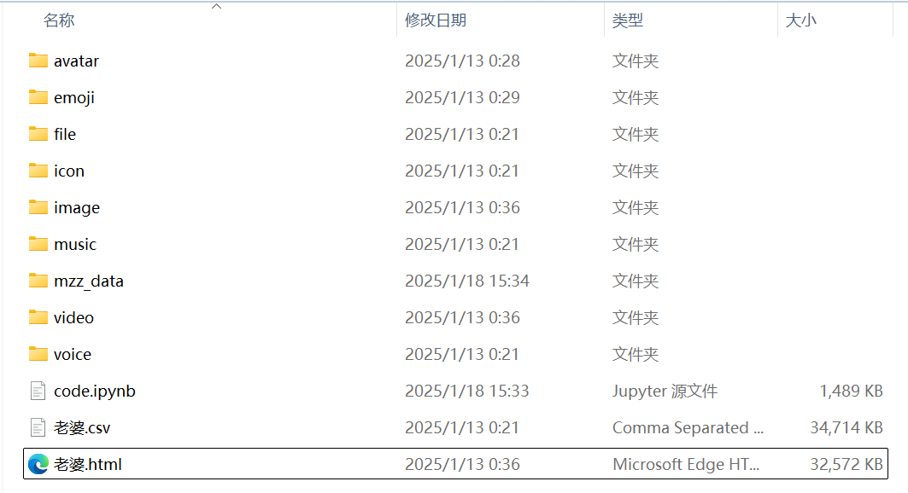
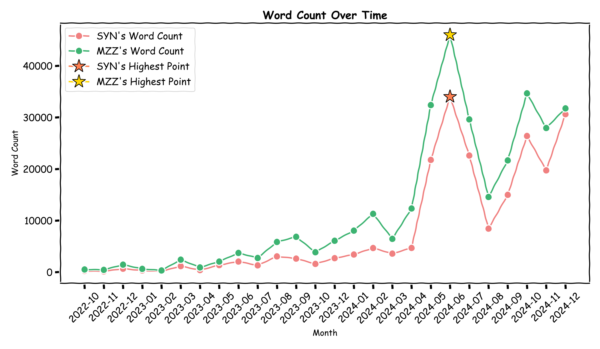
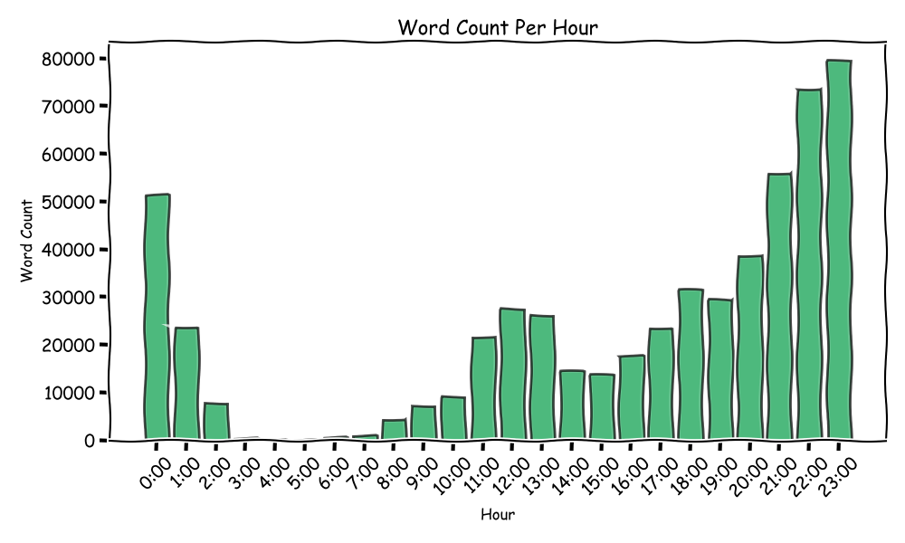
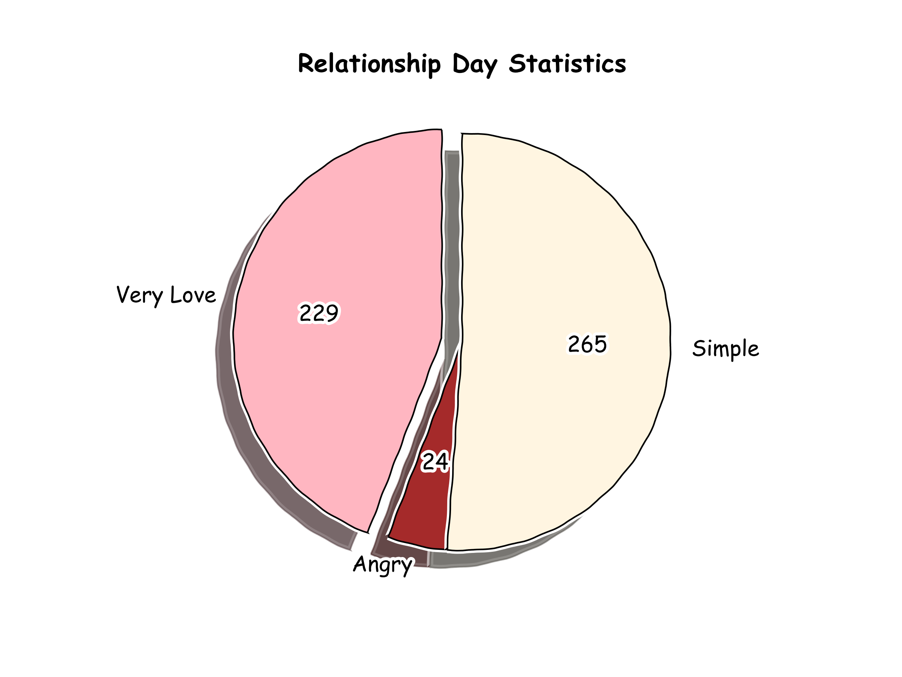
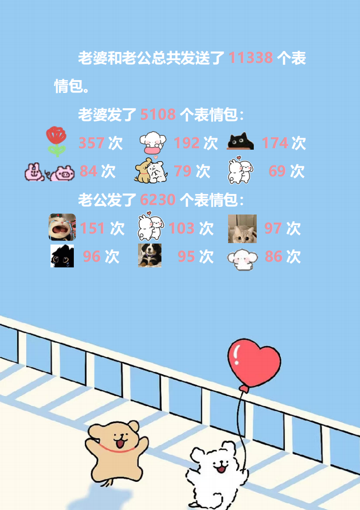
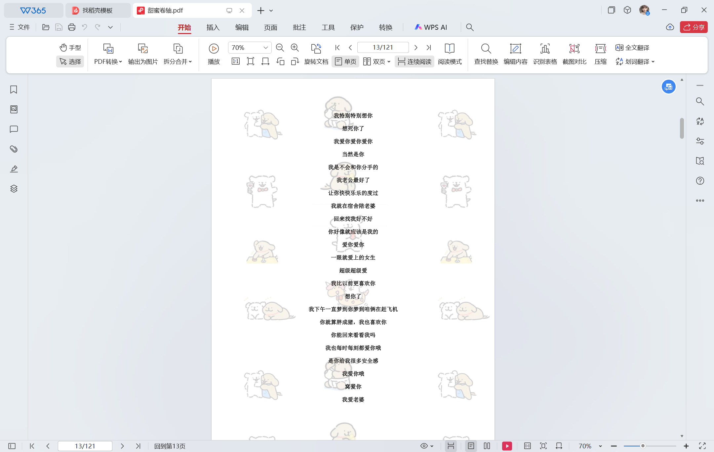

**DeepLove** 是一个基于 **DeepSeek API** 和 **MemoTrace** 由导出的微信聊天记录的恋爱报告生成项目。通过分析你和另一半的聊天记录，生成一份独特的恋爱报告，记录你们的美好时光。

- 生成一份带有统计图表的恋爱报告
- 挑选出你们最甜蜜的对话，整理成一份甜蜜卷轴

# 一、导出微信聊天记录

首先，使用 [MemoTrace](https://memotrace.cn/) 工具来导出微信聊天记录。

## 步骤 1: 下载 MemoTrace

访问 [MemoTrace 官网](https://memotrace.cn/)，下载并安装 MemoTrace 工具。

## 步骤 2: 导出聊天记录
1. 打开微信，进入你想要导出的聊天窗口。
2. 使用 MemoTrace 工具按照提示导出聊天记录。
3. 点击导出CSV和导出HTML。

  

# 二、获取DeepSeek API Key

参考 [DeepSeek官方文档](https://api-docs.deepseek.com/zh-cn/)，获取API Key。

# 三、分析聊天记录

进入MemoTrace/data/聊天记录/老婆(你导出的那个人的微信昵称)，将code.ipynb文件复制到这个文件夹下。

运行code.ipynb文件，生成相关统计结果，你可以自己排版到word中。

部分恋爱报告统计图示例：

部分甜蜜卷轴示例(可以将你们所有甜蜜的对话整理为word文档，可能有百页以上)：
